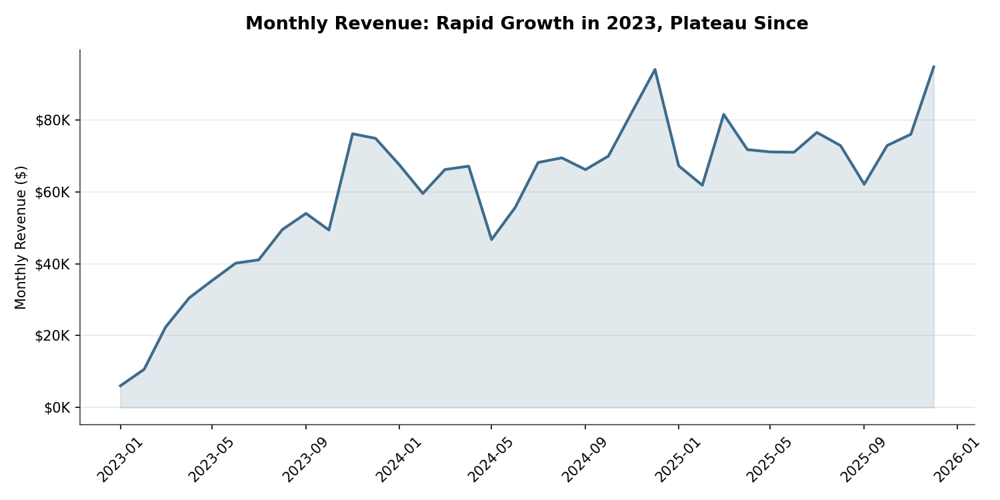
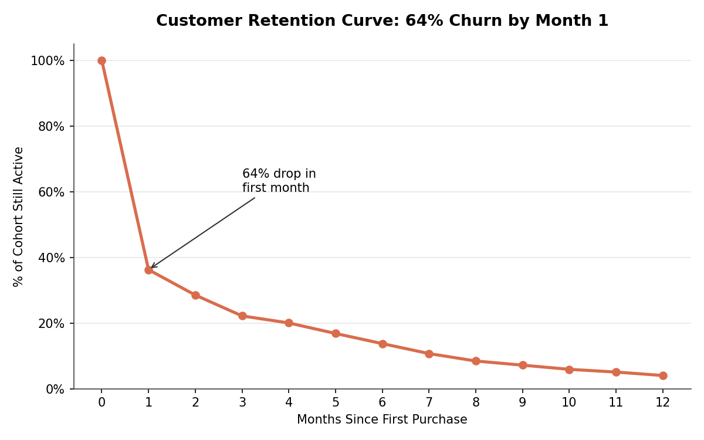
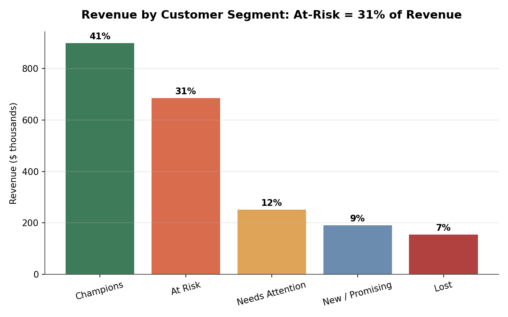

# E-Commerce Customer Retention & Churn Analysis

**A SQL-based analytics project investigating why revenue has plateaued despite continued customer acquisition.**

Built with Google BigQuery (Standard SQL) on a synthetic 3-year e-commerce dataset (~3,000 customers, ~9,000 orders, ~18,700 order line items, Jan 2023–Dec 2025).

---

## Business Question

> Revenue grew rapidly through 2023, then plateaued in 2024–2025 — even though the company kept acquiring new customers every month. Where is the growth going, and what should the business do about it?

---

## Key Findings

### 1. Revenue growth stalled despite continued acquisition
Monthly revenue grew from ~$6K to ~$76K through 2023, then flattened into a choppy $60K–$95K/month range for the following two years, with no sustained upward trend.

### 2. 64% of customers churn after their very first month
Cohort retention analysis shows the steepest drop-off happens immediately: only 36% of customers who make a first purchase return the following month. Retention keeps declining from there, but the first-month cliff is by far the biggest leak.

### 3. $685K (31% of total revenue) sits in an "At-Risk" segment
RFM (Recency, Frequency, Monetary) segmentation shows the At-Risk segment isn't a small edge case — these are customers who previously ordered 5+ times and spent an average of $1,601, but haven't purchased in ~16 months. This is nearly as valuable as the "Champions" segment (41% of revenue) and represents the single largest recoverable opportunity in the business.

### 4. Email is the highest-value acquisition channel
Customers acquired via email have the highest average CLV ($806) and order frequency (2.59 orders/customer) of any channel — ahead of paid search, direct, social, organic, referral, and affiliate. This makes email marketing a strong candidate lever for a retention campaign, not just acquisition.

### 5. Product quality is ruled out as a cause
Refund/cancellation rates are essentially flat across every product category (13.9%–15.8%, std dev 0.68). This rules out a product-quality explanation and confirms the churn problem is behavioral/lifecycle-driven, not tied to a specific category underperforming.

---

## Recommendation

The business's growth problem is not an acquisition problem — new customers keep arriving every month. It's a **first-purchase-to-second-purchase conversion problem**. The highest-leverage fix is a post-purchase lifecycle email campaign (targeting the ~64% who don't return in month 1) combined with a dedicated win-back campaign for the $685K At-Risk segment, using email — already the company's best-performing channel — as the primary vehicle.

---

## Methodology

All analysis was done in BigQuery Standard SQL against four relational tables (`customers`, `products`, `orders`, `order_items`). Queries progressed from foundational to advanced:

| # | Query | SQL Concepts Used |
|---|-------|-------------------|
| 1 | First purchase date per customer | JOIN, aggregation |
| 2 | Monthly cohort retention | CTEs, DATE_TRUNC, DATE_DIFF, self-referencing joins |
| 3 | RFM segmentation | CTEs, window functions (NTILE), CASE statements |
| 4 | CLV by acquisition channel | LEFT JOIN, aggregation |
| 5 | Month-over-month revenue growth | Window functions (LAG), SAFE_DIVIDE |
| 6 | Refund/cancellation rate by category | Multi-table JOIN, COUNTIF |

Full SQL for each query is in [`queries.sql`](queries.sql). Chart generation script is in [`charts.py`](charts.py).

---

## Dataset

Synthetic dataset generated to mimic realistic e-commerce patterns: seasonality (Nov/Dec spikes), a long-tail product popularity distribution, mixed customer loyalty levels (one-time buyers through power users), and intentional data messiness (a small % of missing values) for realistic data-cleaning practice.

| Table | Rows | Description |
|-------|------|--------------|
| `customers` | 3,000 | Customer demographics, signup date, acquisition channel |
| `products` | 160 | Product catalog across 6 categories |
| `orders` | ~8,950 | Order-level status, payment method, total |
| `order_items` | ~18,700 | Line-item detail per order |

---

## Tools Used
- **Google BigQuery** (Standard SQL) — all analysis
- **Python (pandas, matplotlib)** — chart generation from query outputs
